## Project Title: Alexa-Webex Bot Deployment

## Overview:

Welcome to Alexa-Webex Bot deployment!
This project is aimed to simplify the Webex bot deployment process, so that you as a developer can focus on features your Webex bot should have. 

## Components:

Here is a list of components that are involved in this project:

1. **Webex bot:** Webex bots are similar to regular Webex users. They can participate in 1-to-1 and group spaces and users can message them directly or add them to a group space. Webex bots help in automating tasks and can also be used to bring external content into a discussion.

2. **Alexa Skills Kit(ASK):** It is a software development framework that is used to create content, called skills. Skills are similar to apps for Alexa. You can interact with Alexa using voice commands to perform simple tasks. In our project, we will be using Alexa by giving a single voice command to deploy our Webex bot.

3. **AWS Lambda:** Lambda is a serverless platform provided by Amazon, it is event-driven so it basically runs code when an event occurs and automatically allocates computing resources required by that code. 

4. **CircleCI:** CircleCI is a Continuous Integration/Continuous Delivery(CI/CD) platform which helps us automate our code. Whenever any changes are pushed to the code, they'll be automatically reflected in the build.

5. **Docker Container:** Docker is an open source containerization platform. It enables us as a developer to package applications into containers—standardized executable components combining application source code with the operating system (OS) libraries and dependencies required to run that code in any environment.

6. **Heroku:** Heroku is a platform as a service (PaaS) that enables developers to build, run, and operate applications entirely in the cloud. We will be deploying our Webex bot on Heroku.

## Project Workflow:

1. User invokes Alexa using a custom voice command.
2. Once Alexa is invoked, it'll trigger an AWS Lambda function.
3. Our AWS Lambda function will be creating a CI/CD pipeline using CircleCI, pulling our Webex bot's code from this GitHub repository.
4. Once the bot is dockerized using a Docker Container, we can deploy it on a Heroku web server or any other web server of choice.
5. After successful deployment of the Webex bot, it can be added into a Webex Space and be tested.

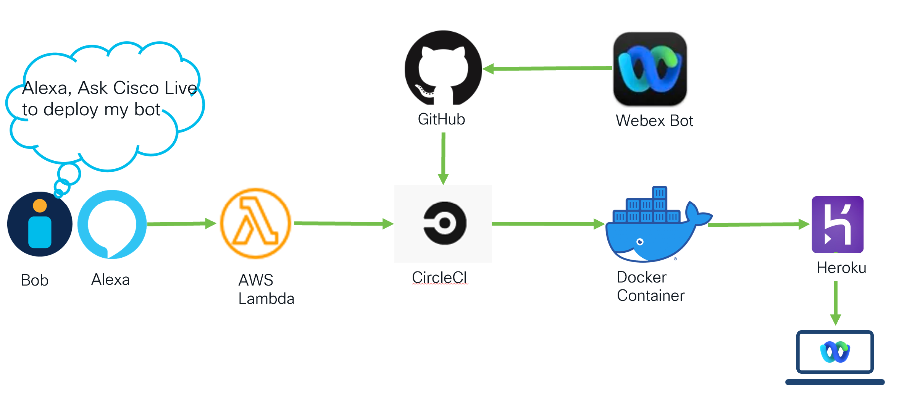

## Creating a Webex Bot:

Before creating our Alexa custom skill, we will have to create our Webex bot and add a few features to it. 
Navigate to https://developer.webex.com/ and after creating a new account, create a new app(bot). Make sure to copy the bot's token and save it, you'll need it later. 

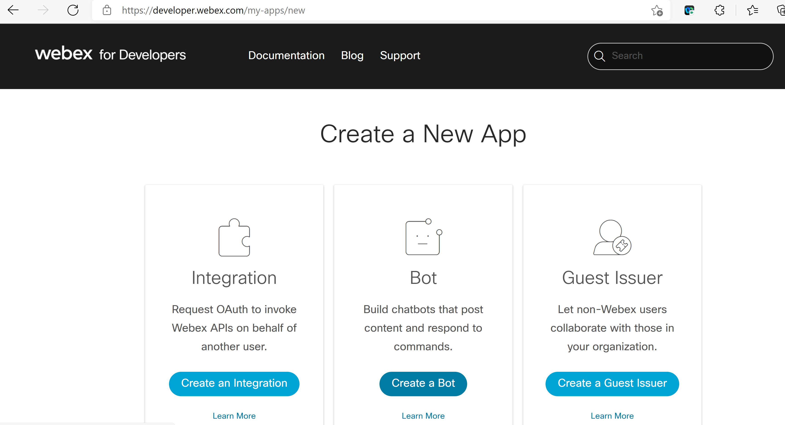

## Adding features to the bot:

Since the focus of this project is "automating" bot deployment, I have added a few basic features to my Webex bot. 
Use case 1: Using Native Cisco APIs: It can create a room, post a file, display basic information about the participants in a space, delete a message, echo a message etc.
Use case 2: Post a joke (used icanhazdadjokes API), you can also use any other random API on the Internet, e.g. weather API.
Use case 3: Integrating with a third-party Cloud Data Loss Prevention tool (Nightfall AI). Nightfall detects sensitive data in SaaS applications.

The code for programming the bot is in Node JS 14.0. These are a few basic features; you can add more features in the "webex_features.js" file located in the "features" folder.

## Creating a Custom Skill using Alexa Skills Kit:

Create a Custom Alexa Skill-Start from Scratch by navigating to https://developer.amazon.com/alexa/console/ask . Give your skill a name, I have named it "cisco live". This name will be used to command Alexa to invoke the custom skill.

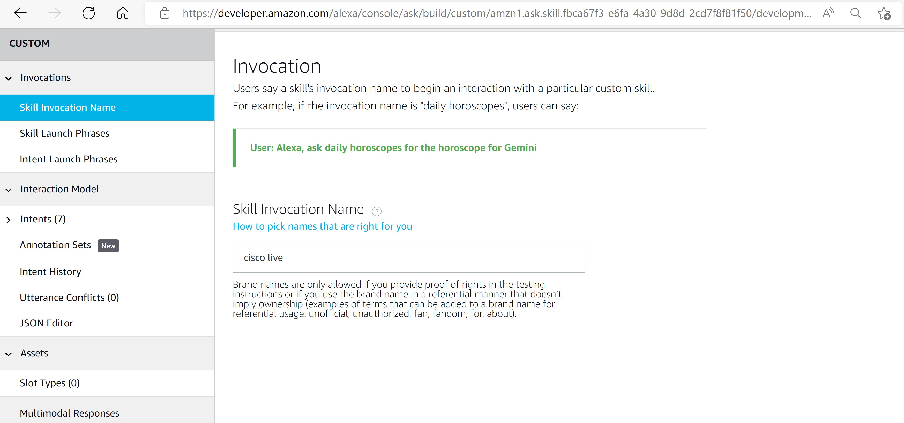

We'll also have to mention a few "Intents". These intents will define the skill's purpose when it is invoked and fulfill the corresponding intent. In my project, I have added an intent named "deployProject" and used three utterances- example, "deploy the bot", "deploy the project" and "project deployment". You can use any other phrase of your choice which you prefer to use.

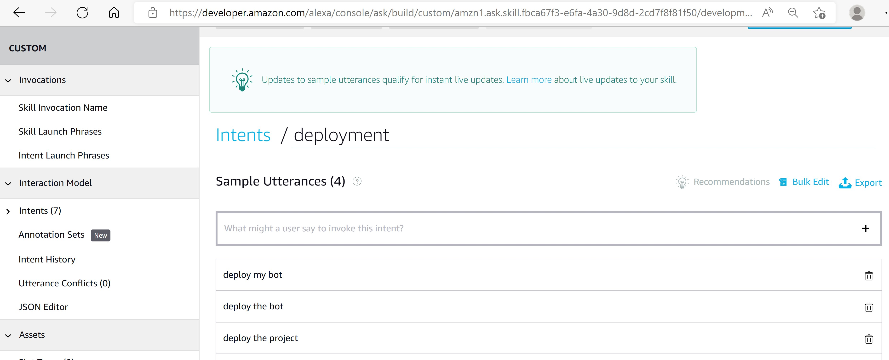

## Tying your Alexa Skill to AWS Lambda:

Before creating an AWS Lambda function, start by creating a role with "programmatic access". IAM roles allow you to delegate access with defined permissions to trusted entities without having to share long-term access keys. So its always considered as a best practice to create a role before you start working in AWS. That way, you'll have access to only those limited set of resources for a specific period of time. Once the role with "programmatic access" is created, create an AWS Lambda function (author from scratch) and assign it to the role created.  
Once the Lambda function is created, make sure to add Alexa Skills Trigger as the Input for this function. Similarly, in ASK, navigate to "Endpoint" section and add your Lambda function's ARN in the "Default Region" section shown below.

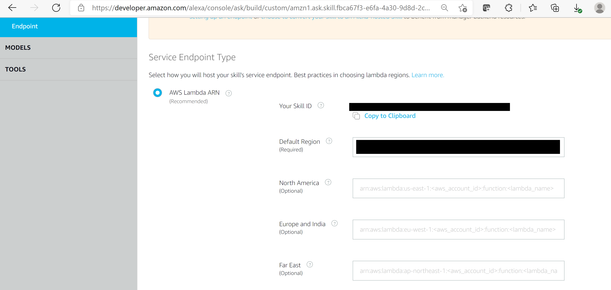

Similarly, in AWS Lambda function, under "Configuration", add your Skills ID and link the function to your skill as shown below.

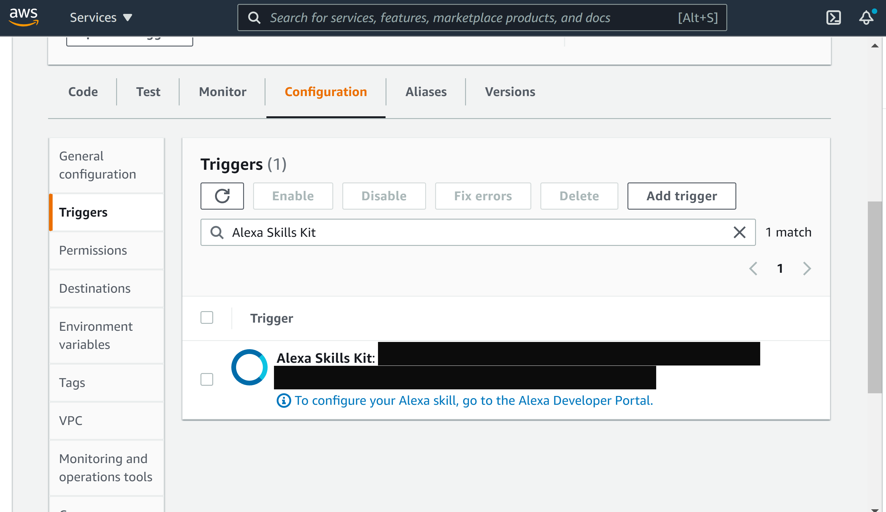

## Using CircleCI to create a CI/CD Pipeline:

Once you grant CircleCI access to your GitHub using OAuth tokens, the next step is to add all usernames and tokens as Environment variables. These tokens/usernames should NEVER be stored as plaintext/variables.

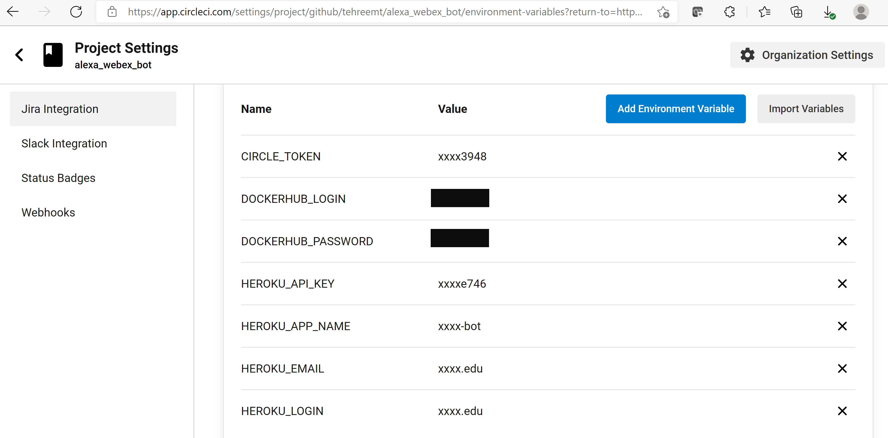

## Dockerizing your bot:

The code to dockerize your bot can be found in the config.yml file in .circleci folder. Before running the commands, make sure you have an active DockerHub account.
To build our bot's docker image, we'll use the following command:

`docker build --cache-from=app -t <FILE_PATH> .`

Do not forget the "." in the end after specifying the file's path.

Next, make a directory using:

`mkdir <CACHE>`

Save your docker image in the newly created directory:

`docker save <PATH>`

If you want to check if the docker image was built, you can use:

`docker ps`

This command will give you the list of all the docker images that exist.

Next step is to log in to the Docker account and push the image.

`docker login -u $DOCKERHUB_LOGIN -p $DOCKERHUB_PASSWORD`

The value of $DOCKERHUB_LOGIN and $DOCKERHUB_PASSWORD will be fetched from the Environment variables.
After successfully logging in, push the docker image.

`docker push <PATH>`

## Deploying your bot on Heroku:

For deploying our docker image on Heroku, you'll have to login to "Heroku Container". Heroku does not allow to push a docker image if only heroku login is used, you need to login to the container.

`heroku container login --username=$HEROKU_LOGIN --password=$HEROKU_API_KEY`

Again, the values of $HEROKU_LOGIN and $HEROKU_API_KEY will be fetched from CircleCI's environment variables.

After logging in to the container successfully, push your image using the following command:

`heroku container: push web --app <APP>`

After pushing the image, Heroku now requires you to release the image. Only pushing the image will not deploy the bot, releasing it is required.

`heroku container: release web --app <APP>`

## Testing if it works!

Ask Alexa to deploy your project by using the voice command of your choice:

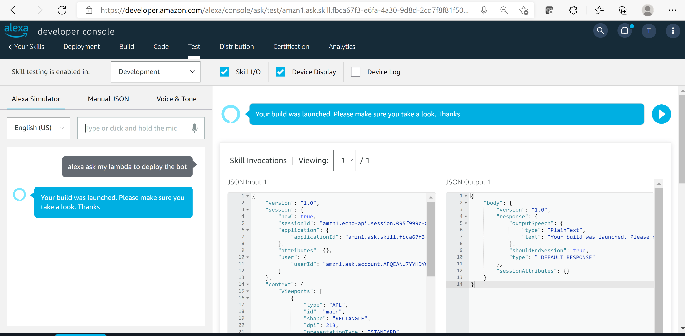

The lambda function is triggered, and the latest code is pushed on the CI/CD pipeline, the status of the build should be successful.

The build section shows the status that the image was built successfully.

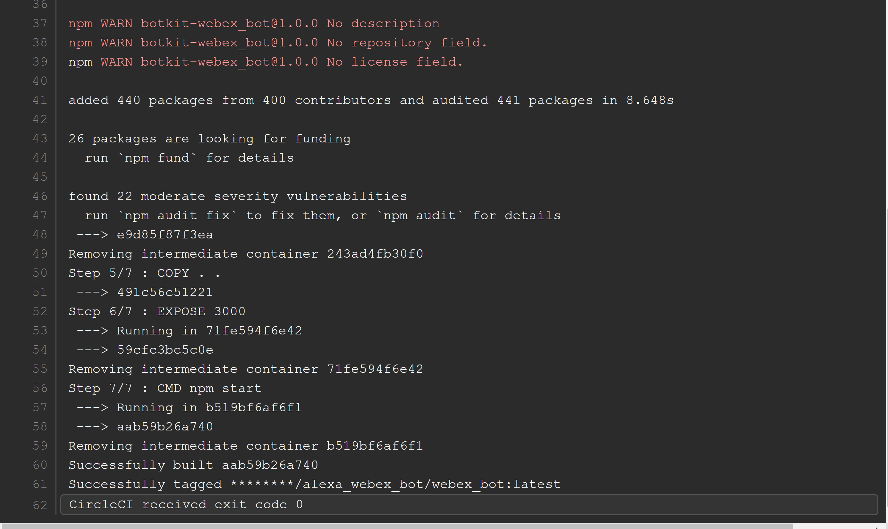

Make sure that the image is pushed:

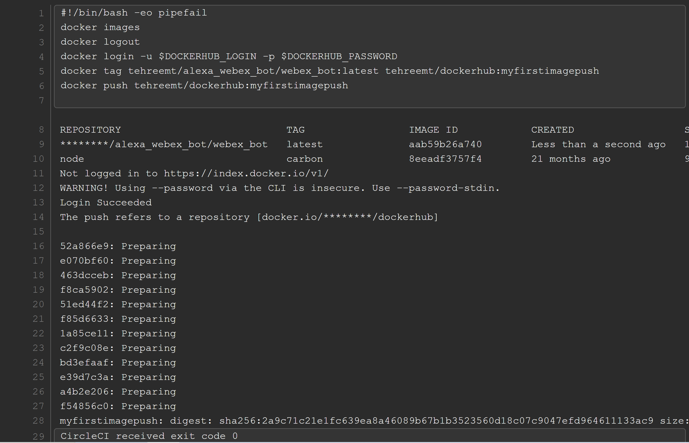

Now we need to see if it was pushed and released on our Heroku Container:

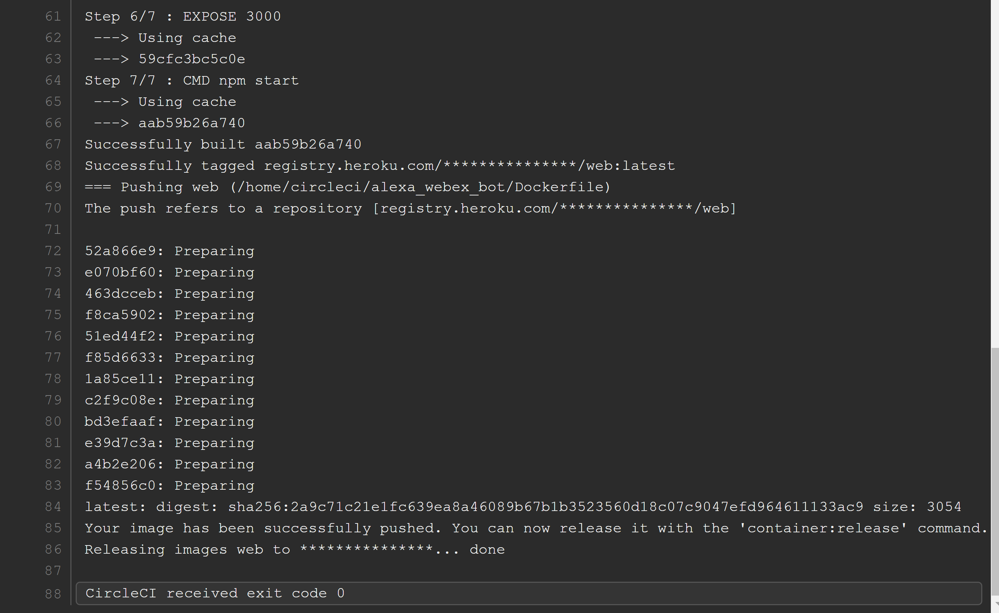

The status of the build is changed to "success":

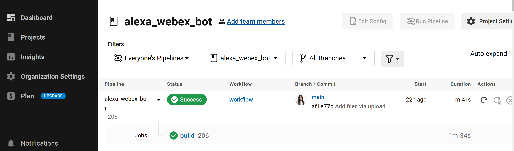

Next, log in to your Heroku account and your dashboard would look like:

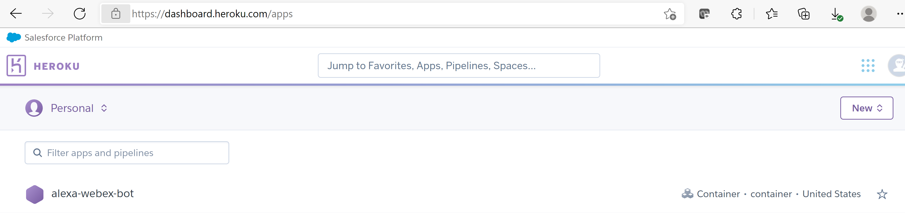

You can check if the bot is deployed by navigating to your bot's Heroku URL:

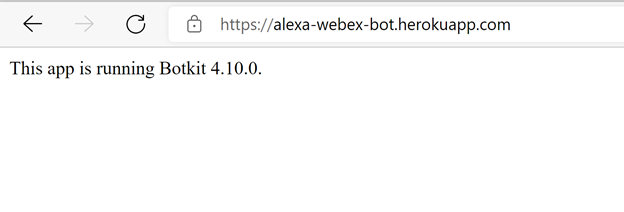

Once the bot is up on Heroku, you can test your bot on Webex.

Log in to Webex and test to see if your bot works.

## Use case 1: Create a room in Webex:

Ask your bot to create a room:

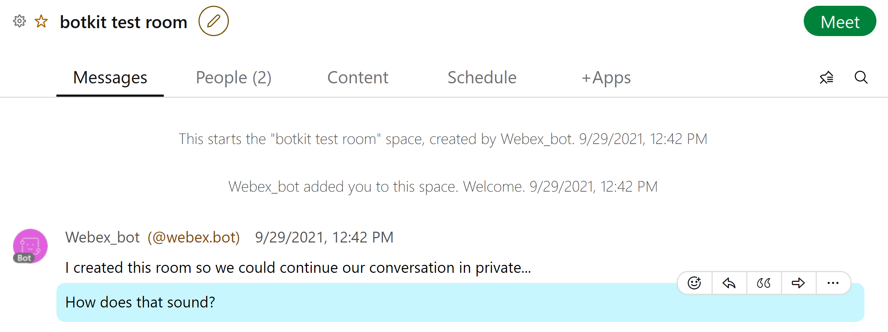

A new room titled "botkit test room" will be created and it would display a message that it has created a room. You can chat with the bot by tagging it.

## Use case 2: Integrating with a random API:

Ask your bot to tell a joke:

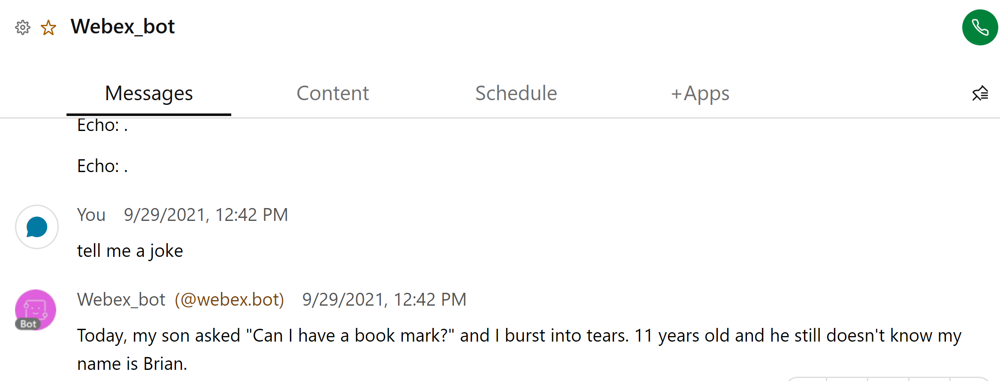

## Use case 3: Third-party Enterprise-grade DLP integration:
 
About Nightfall:
Nightfall is a Cloud DLP(Data Loss Prevention) company, which discovers, classifies and protects data across any app. It uses Machine learning and AI to detect sensitive data - like PII, PHI, etc. It also lets you create your custom regexes. 
So lets get started! 
Create an account on https://app.nightfall.ai/ . An API key can be created by clicking on "Create a Key". Once we have our API key, all we need to do is, create a detection rule and attach it to our policy. In this example, I'll be creating a policy to detect a Credit Card number. 

On the left, there is a list of pre-built set of Machine learning detectors. You can see the list of rules by navigating to "Detectors" section on the left. 
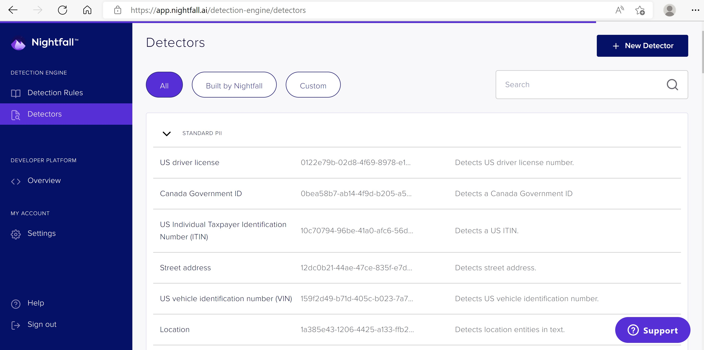 

We'll be using "Credit Card Detector" for this project. 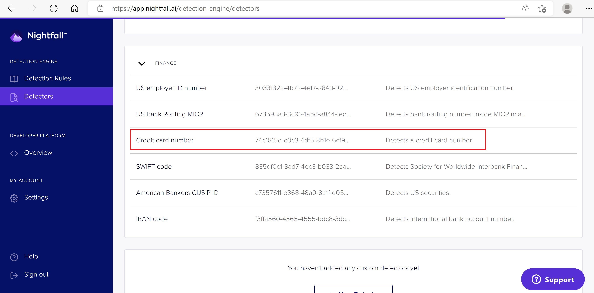

To create a new Detection Rule, click on "Detection Rules". 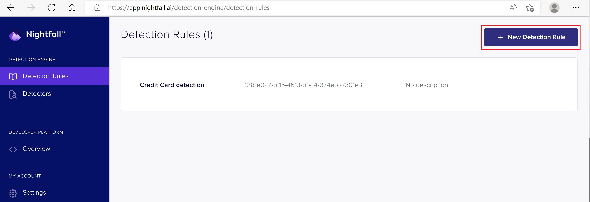
Select "Credit Card Number" and name your detection rule. I have named it "Credit Card detection". 

Attach this detection rule to a new policy and enter an email address where you'd like your alerts to be sent. Nightfall will use the PolicyUUID to scan data that is being sent in Webex. If the policy is violated, an alert would be sent to your email address. You can also send all your alerts through a Webhook.
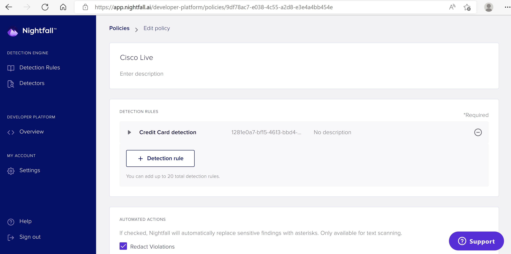

Copy this policy's UUID and attach it to scanText() function specified in features/webex_features.js file. 

Let us see if Nightfall detects a credit card in Webex:

Post a credit card number in webex:
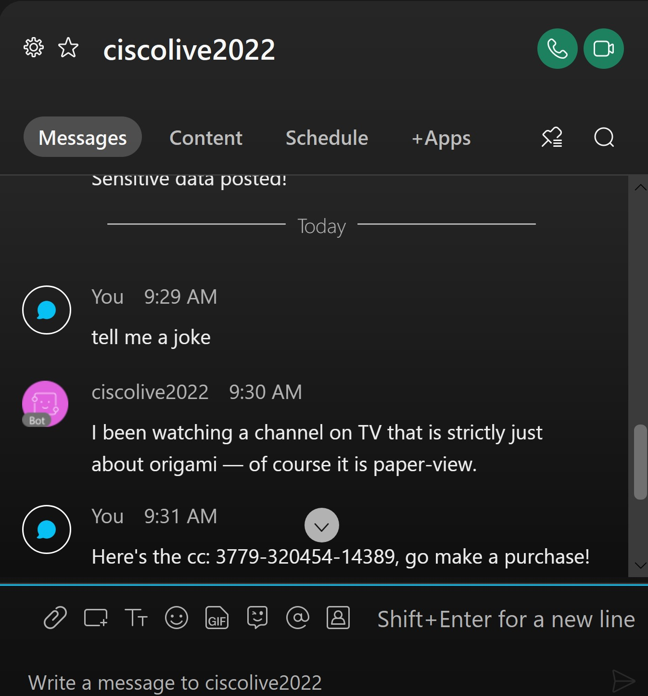

If it was an actual credit card number, you'd receive an email alert from Nightfall which looks like:
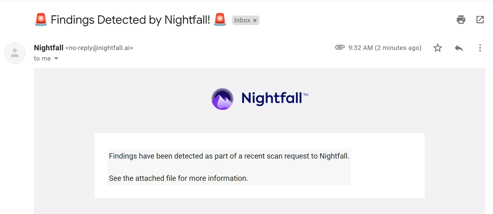

The email will also contain an attachment which has more details related to the data(credit card) that was detected.
